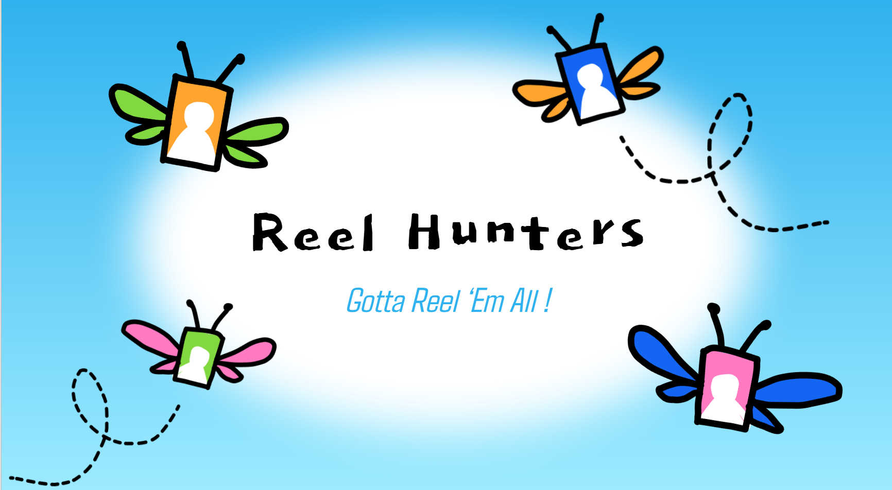
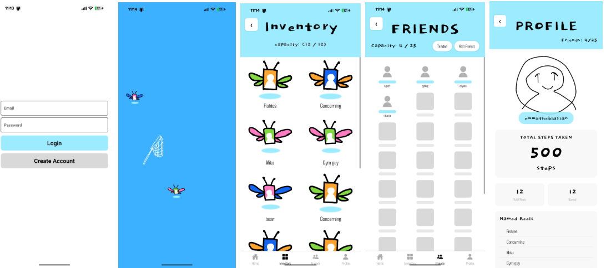

# Welcome to Reel Hunters!!
\
Reel Hunters aims to promote more reflection and mindfulness when consuming short-form content. By disrupting that habitual motion that sucks so many people into the trance-like state of ‘doomscrolling’ through step logging and drag-net catching motions, Reel Hunters prompts users to be more conscious of the media they consume and save. Reel Hunters further reconceives shortform videos as tangible objects with more perceived value beyond temporary passive viewing --through the saving, naming, and gifting mechanisms-- lends to approaching the act of scrolling as active rather than passive. With Reel Hunters, we explore how people interact with short-form content in an increasingly bloated attention economy. How can we continue to push back against the commercialisation of a person’s attention, in a world of increasingly advanced algorithms? 

## Features:
\
In Reel Hunters, users enter in a step count to access checkpoints where they can catch what are "bug-reels." Users have the option to catch and release a bug-reel (if its not to their liking), or save it to their inventory and give the video a name. Reel Hunters also supports adding other users as friends and the ability to send them some bug-reels (which then leaves your inventory). 

## External Libraries:

Reel Hunters was built using React Native Expo. User authentication data storage was done through Firebase and Firestone respectively.

## Use Instructions:

If running Reel Hunters on mobile (ideal):
+ Download the Expo Go app on your mobile device
+ Run "git clone -b mobile-version --single-branch https://github.com/mivyer/gotta-reel-them-all.git" in terminal

If running Reel Hunters on web: 
+ Run "git clone -b web-version --single-branch https://github.com/mivyer/gotta-reel-them-all.git" in terminal

Then, proceed by running in terminal: 
+ cd gotta-reel-them-all
+ npm install
+ npm start

**NOTE: it is also possible to deploy the web-version branch on a mobile device. The mobile-version branch is simply more optimized for mobile use. Simply follow the instructions for deploying on mobile after running npm start. Videos in the web-version also appear a little wonky on a laptop, but appear great if deployed on mobile!**

## Contributors

**Emma Gandonou:** \
&emsp; Pomona College '26 

**PJ James:** \
&emsp; Pomona College '28 

**Nicole Kerschner:** \
&emsp; Scripps College '26 

**Ivyer Qu:** \
&emsp; Pomona College '26 

**Alyssa Wu:** \
&emsp; Pomona College '28 

